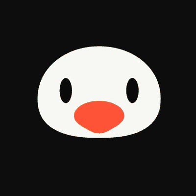
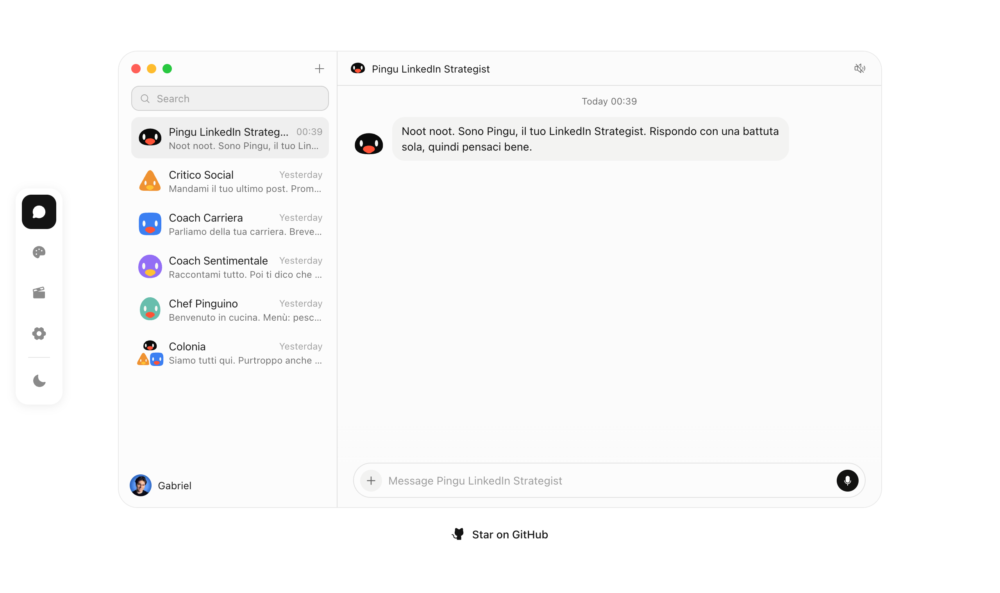
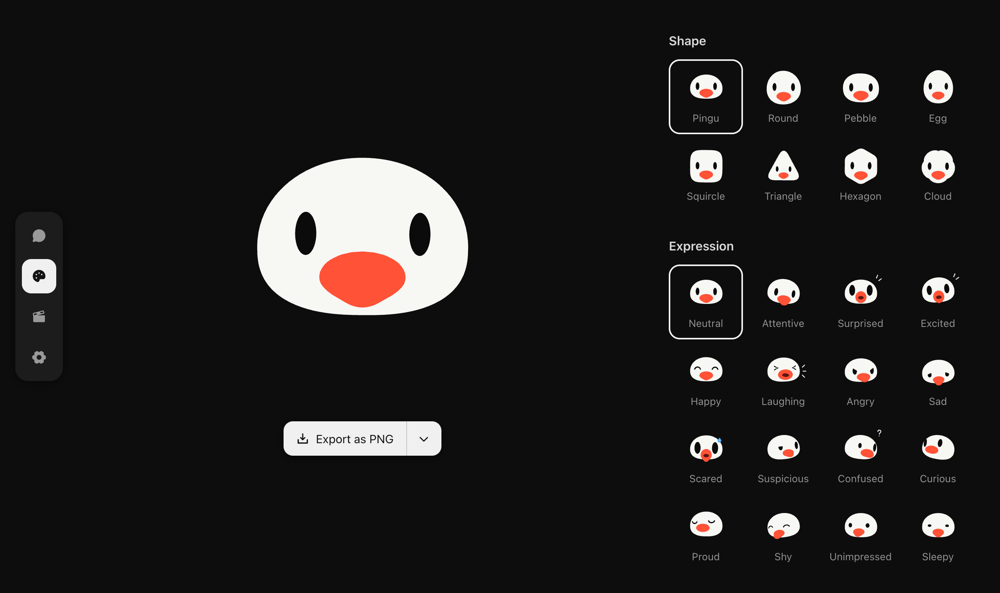
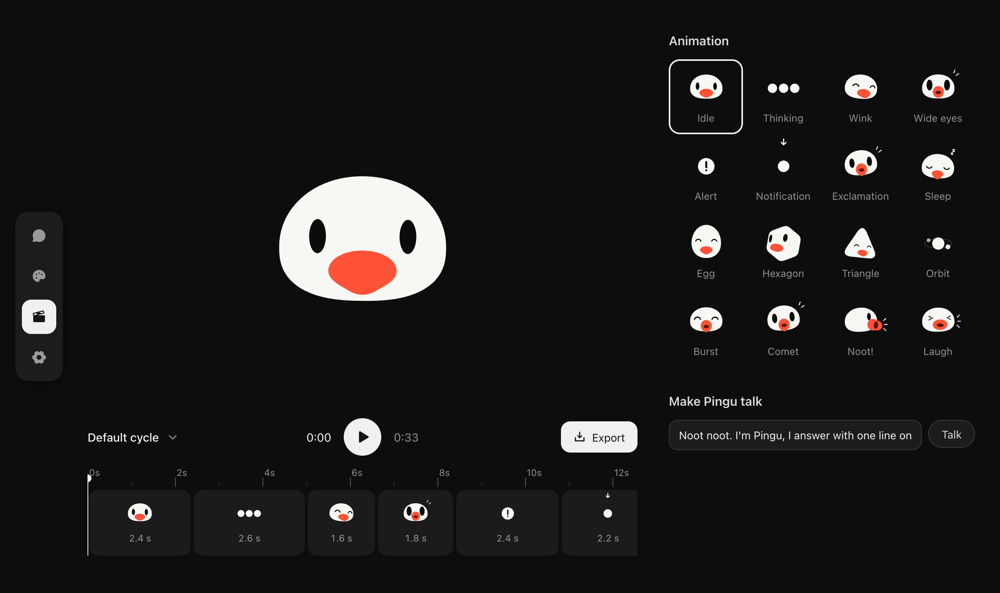
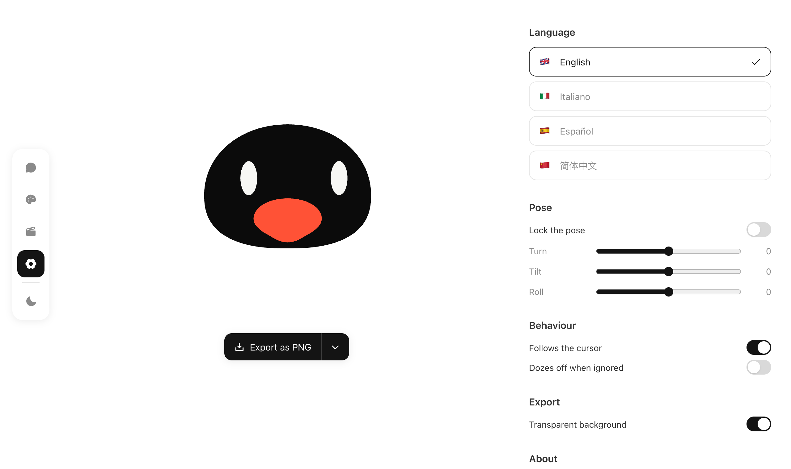
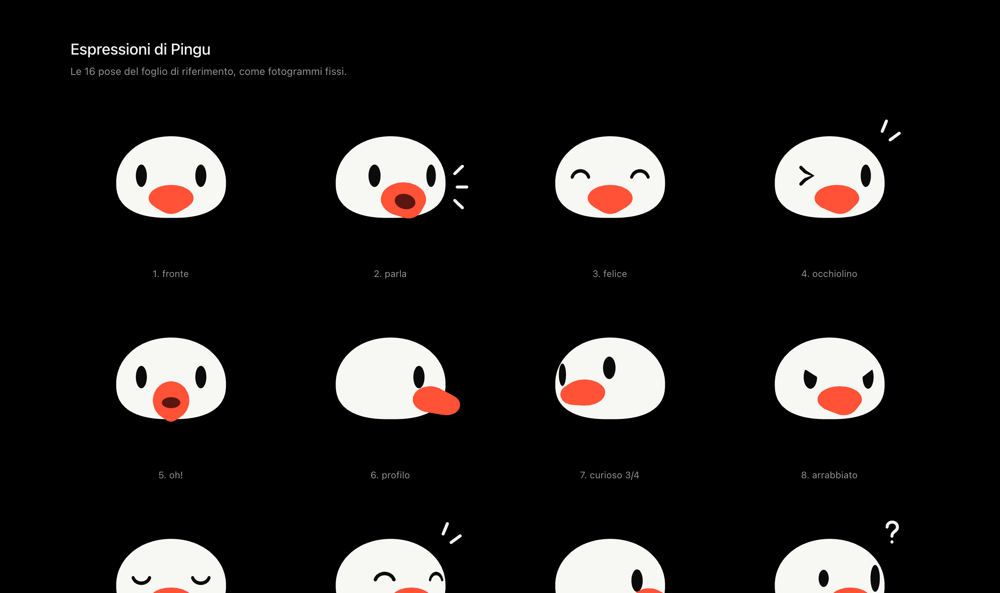

<div align="center">



# Pingu avatar

**An animated penguin avatar for React.** Noot noot.

36 expressions · 10 body shapes · any colour · lip-sync · spins and confetti · PNG, SVG, GIF and MP4 export

[**Live demo**](https://pingu-avatar.vercel.app) · [Avatar docs](avatar/README.md) · [Demo chat](https://pingu-avatar.vercel.app/chat)

</div>

---

## What's inside

- **A reusable avatar** in [`avatar/`](avatar/): one inline SVG driven by a small spring engine.
  Every avatar on the page shares one `requestAnimationFrame`, off-screen ones pause, and
  `prefers-reduced-motion` gets a still frame. No dependencies besides React.
- **A studio** to pick shape, expression and colour, stitch expressions into a montage on a
  timeline, and export the result as PNG, SVG, animated SVG, GIF or MP4.
- **A demo chat** where penguin personas answer with one dry one-liner. There is no backend
  and no LLM: replies come from keyword rules, and the avatar lip-syncs as each line types out.

Everything runs in the browser, in English, Italian, Spanish and Chinese: the interface and
the penguins' jokes alike. Switching language re-translates the chat history too.

## Tour

The demo chat comes first, then the studio: one page with three tabs on the floating rail
(Customise, Animation, Settings), and a reference sheet. Every page has a light and a dark
theme; the screenshots are in dark mode.

### Chat · [`/chat`](https://pingu-avatar.vercel.app/chat)

A Grok-style chat with penguin personas: a LinkedIn strategist, a social media critic, a career
coach, a dating coach, a chef, and Colonia, a group chat where they all answer. Each reply is one
line, typed out while the avatar lip-syncs and then reacts with a mood.



### Customise · [`/`](https://pingu-avatar.vercel.app)

Pick a body shape, an expression and a colour, and watch Pingu morph between them. The export
button downloads or copies the result as PNG, SVG, animated SVG or GIF.



### Animation · [`/?tab=motion`](https://pingu-avatar.vercel.app/?tab=motion)

Click animations (wink, orbit, noot!, laugh…) to line them up on a timeline, drag a clip's edge
to change its length, and play the montage back. **Export** records it as an MP4 (white background) or
a GIF (white or transparent). You can also type a line and make Pingu say it, with
lip-sync.



### Settings · [`/?tab=settings`](https://pingu-avatar.vercel.app/?tab=settings)

Interface language, a pose you can lock (turn, tilt, roll), whether Pingu follows the cursor
or dozes off when ignored, and a transparent background for exports.



### Expressions · [`/espressioni`](https://pingu-avatar.vercel.app/espressioni)

The 16 poses of the original reference sheet as still frames (in Italian): handy to check the
faces side by side while working on the engine.



## Use the avatar in your project

The avatar is distributed the [shadcn](https://ui.shadcn.com) way: copy the
[`avatar/`](avatar/) folder into your React project and import from it. No package to install,
and you own the code.

```tsx
import { PinguAvatar } from "./avatar";

<PinguAvatar size={120} state="happy" />
<PinguAvatar size={80} shape="egg" color="#3b8be8" state="curious" />
```

Want a spin? Grab a ref:

```tsx
const pingu = useRef<PinguHandle>(null);

<PinguAvatar ref={pingu} size={160} onClick={() => pingu.current?.spinBounce()} />
```

The default colour follows the theme: a black Pingu with white eyes on light pages, a white
one with dark eyes on dark pages. [`avatar/README.md`](avatar/README.md) covers every prop,
state and shape, theming with CSS variables, the event bus and the optional exports.

## Run the site

```bash
npm install
npm run dev        # http://localhost:3000
```

| Command | |
|---|---|
| `npm run dev` | Development server |
| `npm run build` / `npm start` | Production build and server |
| `npm run lint` | ESLint |
| `npm run typecheck` | TypeScript |

| Page | |
|---|---|
| `/chat` | The demo chat |
| `/` | Studio, Customise tab |
| `/?tab=motion` | Studio, Animation tab (montage editor) |
| `/?tab=settings` | Studio, Settings tab |
| `/espressioni` | Reference sheet of the 16 poses |

## Structure

```
avatar/        the reusable avatar (copy this folder)
  engine/      spring engine: states, shapes, faces, effects, the shared animation loop
  export/      optional PNG / SVG / GIF / MP4 export
app/           Next.js routes and global styles
components/    studio, chat and shared UI
lib/           chat personas and replies, i18n, montage catalogue
hooks/         chat state
```

Built with Next.js 16, React 19, Tailwind CSS 4 and [Phosphor icons](https://phosphoricons.com).
Notes for contributors (and coding agents) are in [`CLAUDE.md`](CLAUDE.md).

## Credits

Made by Gabriel Spicuglia. If you use the avatar, a ⭐ on this repo or a line to say hello is
appreciated.

This is a non-commercial exploration project. The avatar's design, animations and the chat
layout are based on xAI's Grok Bot (x.ai/bot); all rights to the original design belong to
their owners, with the utmost respect for their work. "Pingu" is a trademark of its respective
owners. This project is not affiliated with, or endorsed by, xAI or the owners of Pingu.

## Licence

[MIT](LICENSE)
